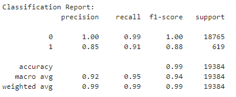
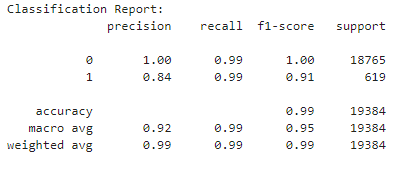

# Unit 12 - Credit Risk Classification Report

## Overview of the Analysis

### The purpose of this analysis was to evaluate the performance of machine learning models in predicting the credit risk of loans, specifically determining whether a loan is a healthy loan (label 0) or a high-risk loan (label 1). Accurate credit risk prediction is essential for financial institutions to make informed lending decisions and manage their risks effectively.

### The financial data provided contained information on various loans, including factors such as loan size, interest rate, borrower income, and other relevant variables. The goal of the analysis was to predict the loan status (healthy or high-risk) based on these features.

### The target variable (loan status) had imbalanced classes, with a significantly larger number of healthy loans compared to high-risk loans. The value_counts function was used to display the distribution of the target variable in the dataset.

### The machine learning process included the following stages:
1. Data preprocessing: Cleaning and preparing the data for modeling, including handling missing values, encoding categorical variables, and splitting the data into training and testing sets.

2. Model training: Fitting a logistic regression model using the training data.

3. Model evaluation: Assessing the performance of the model by making predictions on the testing data and generating a classification report containing metrics such as precision, recall, and F1-score.

4. Data resampling: Using the RandomOverSampler module from the imbalanced-learn library to balance the target variable in the training data.

5. Model training with resampled data: Fitting another logistic regression model using the resampled training data.

6. Model evaluation with resampled data: Assessing the performance of the model with resampled data by making predictions on the testing data and generating a classification report.

### Methods used in this analysis included logistic regression for binary classification (LogisticRegression from sklearn) and random oversampling for handling imbalanced data (RandomOverSampler from imbalanced-learn). The logistic regression models were evaluated based on their ability to predict both healthy and high-risk loans accurately, and their performance was compared to determine which model was more effective in identifying credit risk.

## Results

### Machine Learning Logistic Regression Model:
  

### Machine Learning Model 2:
  

## Summary

### The logistic regression model fit with oversampled data appears to perform better in predicting high-risk loans (label 1) compared to the logistic regression model fit with the original data. The oversampled model has a recall of 0.99 for high-risk loans, which is higher than the recall of 0.91 for the original model. This indicates that the oversampled model can identify a larger percentage of actual high-risk loans. Furthermore, the F1-score for high-risk loans is also higher (0.91) for the oversampled model compared to the original model (0.88), indicating a better overall performance in predicting high-risk loans.

### The performance of the model may depend on the problem we are trying to solve. In this case, predicting high-risk loans (label 1) is more important, as financial institutions need to accurately identify potential loan defaults to minimize their risks. Therefore, a model with better performance in predicting high-risk loans would be more valuable.

### Based on these results, we recommend using the logistic regression model fit with oversampled data. This model provides a better performance in predicting high-risk loans, which is crucial for effective credit risk management. The oversampled model also maintains excellent performance in predicting healthy loans (label 0), ensuring that it remains effective in identifying both types of loans.
